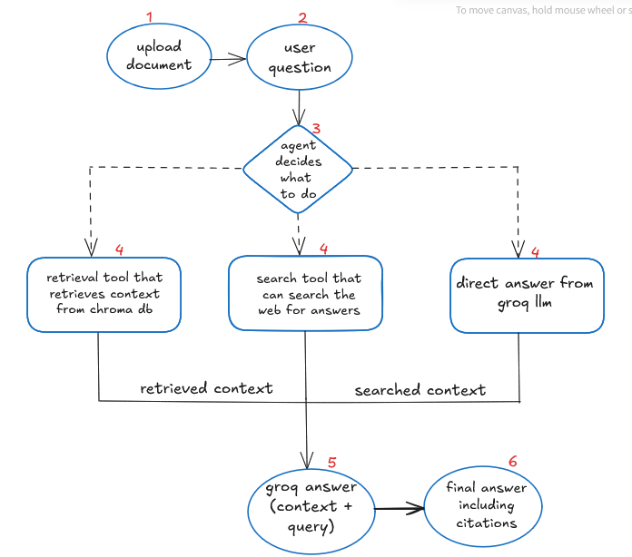

# Project Plan: Enterprise Document Copilot

## 1. Problem
Enterprises store huge amounts of data across multiple platforms. Finding the right information is slow and inefficient at times difficult.  

## 2. Proposed Solution
Build an AI-powered knowledge assistant that uses **document ingestion + agentic reasoning + vector search + LLM** to provide accurate, contextual answers with citations.  

## 3. Architecture
- **Data Layer:** Document storage Vector DB (Chroma).  
- **Processing Layer:** Document parsing (LangChain).  
- **AI Layer:** Retrieval-Augmented Generation (RAG) with LLM (Groq).  
- **App Layer:** FastAPI backend + streamlit frontend. 

## 4. System Workflow
The system workflow will be Logged in LangSmith (Traces, metrics and debugging)

  

## 5. Minimum Viable Product (MVP) Scope
- Upload & parse PDFs.  
- Reasoning chatbot with citations.  
- Web dashboard with login.  

## 6. Future Enhancements
- Integrations (Slack/Teams).  
- Advanced analytics.  
- On-prem deployment.  
